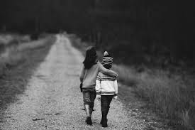

# 02.3 - Paragraph Flow Around Images

## Overview

This project demonstrates how text can flow naturally around images using CSS float properties. Images are positioned alternately on the left and right sides of the page, allowing paragraphs to wrap around them similar to layouts commonly found in books, magazines, and newspapers.

---

## Live Demo

🔗 **View Project**

https://pinakapani48.github.io/WEBDEVELOPMENT-TUTLY/02.3-paragraph/

---

## Project Structure

```text
02.3-paragraph
│
├── index.html
├── styles.css
├── siblings.jpg
├── sunset.jpg
└── README.md
```

---

## Features Implemented

* Multiple images
* Paragraphs
* External CSS
* Left-aligned image
* Right-aligned image
* Text wrapping around images
* Margins around images
* Font sizing
* Line spacing
* Book and newspaper style layout

---

# Concepts Learned

## 1. Image

Used to display images on the webpage.

### Syntax

```html

```

---

## 2. Paragraph

Used to display textual content.

### Syntax

```html
<p>
    Paragraph content goes here.
</p>
```

---

## 3. External CSS

Used to separate structure and styling.

### Syntax

```html
<link rel="stylesheet" href="./styles.css">
```

---

## 4. Floating an Image to the Left

Allows text to wrap around the image.

### Syntax

```css
.img1{
    float: left;
    margin: 20px;
}
```

### Output

```text
IMAGE      Paragraph content...
IMAGE      More text...
IMAGE      More text...
```

---

## 5. Floating an Image to the Right

Places the image on the right side while text flows on the left.

### Syntax

```css
.img2{
    float: right;
    margin: 20px;
}
```

### Output

```text
Paragraph content...      IMAGE
More text...              IMAGE
More text...              IMAGE
```

---

## 6. Text Wrapping Around Images

Text automatically wraps around floated elements.

### Syntax

```css
float: left;

float: right;
```

---

## 7. Margins

Used to create space between images and surrounding text.

### Syntax

```css
margin: 20px;
```

---

## 8. Font Size

Controls the size of paragraph text.

### Syntax

```css
font-size: 1rem;
```

---

## 9. Line Height

Controls the spacing between lines of text, improving readability.

### Syntax

```css
line-height: 1.5rem;
```

---

## 10. Universal Selector

Applies styles to all elements.

### Syntax

```css
*{
    margin: 0;
    padding: 0;
    box-sizing: border-box;
}
```

---

## 11. Box Sizing

Ensures padding and borders are included within the total size of elements.

### Syntax

```css
box-sizing: border-box;
```

---

## Files Used

### index.html

Contains:

* Images
* Paragraphs

### styles.css

Contains:

* Float properties
* Margins
* Font size
* Line height
* Box sizing

---

## Outcome

By completing this project, I learned how to position images on both sides of a webpage and allow text to flow naturally around them. This technique is commonly used in books, newspapers, magazines, and article pages and helped me understand the practical use of CSS float properties.

---

## Repository

**Repository:** WEBDEVELOPMENT-TUTLY

**Project:** 02.3 - Paragraph Flow Around Images

**Author:** Pinaka Pani Vinay Kumar
